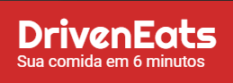
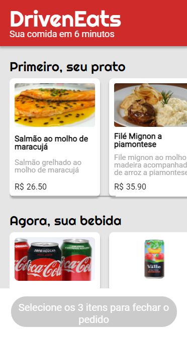
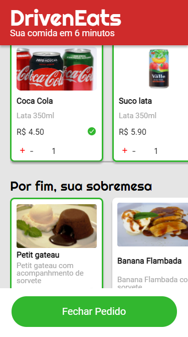
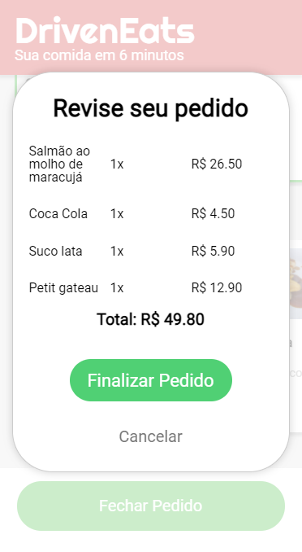

<h1 align="center"></h1>

# Description
Driven eats is a mobile only aplication to order food and send the message to the restaurant by WhatsApp. The user can select any type of principal meal, beverages , and desserts. In the end of order it will open a modal showing all the ordered products, by clicking to close order it will send a formated message to the restaurant number on WhatsApp. 

# Layout

 
 
 

 Figma file <a href="https://www.figma.com/file/nkRQD9TcxvzLQFO27JsGV1/FoodCamp-%5BReact%5D">here</a>
---

# How to Run 

### Dowload the project file and run **Npm i** to install the dependencies. Setup the "numberToSend" variable in src/components/Confirmation.js file to set the number that it will send the message, then run Npm start to run on local host. 

# Technologies

The following tools were used in the construction of the project:

**Frontend**  ([React](https://reactjs.org/))

-   **[Ion-icons](https://ionic.io/ionicons)**
-   **[React-Modal](https://www.npmjs.com/package/react-modal)**

## Author

Developed by Pedro Hotz Bronzato.
